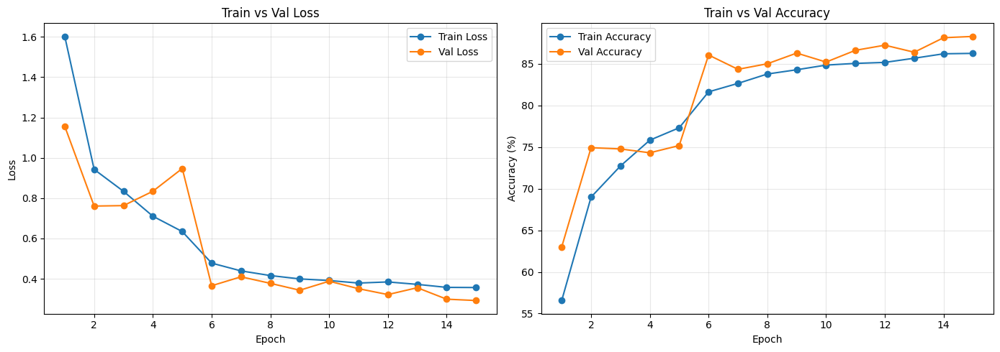

# Multi-Cancer Image Classification

A computer-vision comparison of three approaches for classifying **26 cancer / histopathology image classes**:

1. a custom convolutional neural network trained from scratch,
2. a frozen **Phikon** pathology foundation-model backbone with a learned linear classifier,
3. **Qwen2-VL-2B-Instruct** fine-tuned with LoRA using Unsloth.

The project was developed and run in a Kaggle GPU notebook using the `obulisainaren/multi-cancer` dataset.

> **Educational/research project only.** This repository is not a clinical diagnostic tool and should not be used for medical decisions.

## Results

| Model | Test accuracy | Macro F1 | Status |
|---|---:|---:|---|
| Custom CancerCNN | 88.31% | 0.881 | Evaluated |
| Phikon + linear head | **97.23%** | **0.971** | Evaluated |
| Qwen2-VL + LoRA | — | — | Fine-tuned, not yet evaluated |

Phikon produced the strongest held-out result, improving test accuracy by **8.92 percentage points** over the custom CNN.

See [`RESULTS.md`](RESULTS.md) for per-class performance, training details, and the Qwen fine-tuning results.

## CNN training behavior



The custom CNN reached **88.28% validation accuracy** after 15 epochs and **88.31% test accuracy**.

## Models

### 1. Custom CancerCNN

The baseline CNN uses:

- input size: `112 x 112`
- convolution channels: `3 -> 16 -> 16 -> 32 -> 32`
- BatchNorm + ReLU activations
- two max-pooling operations
- dropout: `0.3`
- final linear classifier over 26 classes
- weighted cross-entropy
- Adam optimizer
- mixed-precision training
- multi-GPU `DataParallel` when two GPUs are available

The dataset was capped at **1,000 images per class** (26,000 images total in this run) and split into:

- 18,200 training images
- 3,900 validation images
- 3,900 test images

### 2. Phikon transfer learning

The project loads `owkin/phikon`, freezes the pretrained ViT backbone, extracts the CLS-token representation, and trains only a `Linear(768, 26)` classification head.

Training configuration:

- input size: `224 x 224`
- frozen backbone
- Adam optimizer
- learning rate: `1e-3`
- 5 epochs
- batch size: 128

Final results:

- validation accuracy: **96.82%**
- test accuracy: **97.23%**
- macro F1: **0.971**
- weighted F1: **0.972**

### 3. Qwen2-VL LoRA fine-tuning

`unsloth/Qwen2-VL-2B-Instruct` is loaded in 4-bit mode and adapted with LoRA.

Configuration captured in the notebook:

- 3,900 training samples (150 per class)
- 1 epoch / 244 steps
- batch size 8
- gradient accumulation 2
- effective batch size 16
- learning rate `2e-4`
- LoRA rank 16
- LoRA alpha 16
- 28,950,528 trainable parameters / 2,237,936,128 total
- 1.29% of parameters trained
- final logged loss: **0.019066**

The notebook does **not** evaluate the fine-tuned Qwen model on the held-out classification test set. It is therefore intentionally excluded from the accuracy comparison.

## Dataset classes

```text
all_benign        all_early         all_pre           all_pro
brain_glioma      brain_menin       brain_tumor
breast_benign     breast_malignant
cervix_dyk        cervix_koc        cervix_mep        cervix_pab        cervix_sfi
colon_aca         colon_bnt
kidney_normal     kidney_tumor
lung_aca          lung_bnt          lung_scc
lymph_cll         lymph_fl          lymph_mcl
oral_normal       oral_scc
```

## Repository structure

```text
multi-cancer-model-comparison/
├── notebooks/
│   └── cancer_model_comparison.ipynb
├── results/
│   ├── cnn_training_curves.png
│   ├── cnn_confusion_matrix.png
│   ├── cnn_classification_report.csv
│   ├── phikon_classification_report.csv
│   ├── qwen_training_loss.csv
│   ├── qwen_training_loss.png
│   └── model_summary.csv
├── .gitignore
├── LICENSE
├── README.md
├── REQUIREMENTS.md
├── RESULTS.md
└── requirements.txt
```

## Running the notebook

The notebook was written for a Kaggle GPU environment.

1. Create a Python environment or Kaggle notebook.
2. Install the dependencies in `requirements.txt`.
3. Make sure CUDA is available for the GPU experiments.
4. Run `notebooks/cancer_model_comparison.ipynb`.

The notebook downloads the dataset with:

```python
kagglehub.dataset_download("obulisainaren/multi-cancer")
```

It then flattens the class folders into `/kaggle/working/flat_dataset`.

## Saved model outputs

The notebook saves these artifacts in the Kaggle working directory:

```text
cancer_cnn.pt
phikon_head.pt
qwen-cancer-finetuned/
qwen-cancer-finetuned.zip
```

These files are intentionally ignored by Git because trained checkpoints can be large. If you want to distribute weights later, use a model host or GitHub Releases rather than committing them directly to the repository.

## Environment captured by the notebook

The saved run reports:

- Python 3.12.13
- PyTorch 2.10.0 + CUDA 12.8 build
- Transformers 5.5.0
- Unsloth 2026.6.9
- Tesla T4 GPU environment

See [`REQUIREMENTS.md`](REQUIREMENTS.md) for reproducibility notes.

## Limitations

- The three approaches do not use identical training procedures.
- Qwen2-VL has no held-out evaluation in the current notebook.
- The experiment uses a capped sample of up to 1,000 images per class for CNN/Phikon training and evaluation.
- A random global split is used after per-class sampling; it is not explicitly implemented with a stratified split utility.
- Strong benchmark accuracy does not establish clinical validity.

## License

Code in this repository is released under the MIT License. The dataset and pretrained models are external resources and remain subject to their own licenses and terms.
